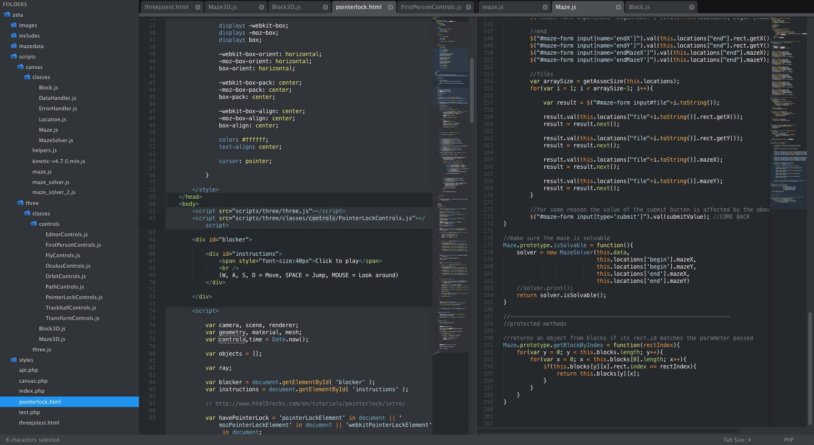
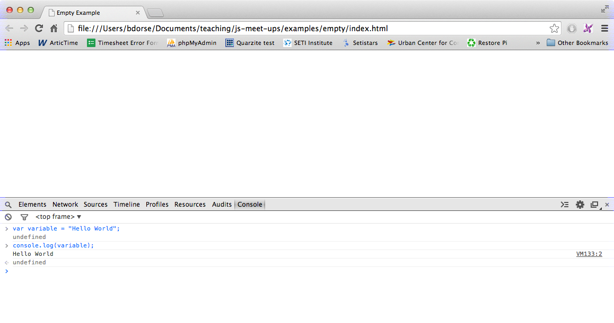

# Week 1

## What is JavaScript?

JavaScript (JS) is __primarily__ a client-side scripting language that runs in the web browser. This means that, aside from some new exceptions, JavaScript is used to build web-apps that run when visited on the browser instead of applications that live on your computer.

JavaScript is widely regarded as the front-end language of the web as it replaced Flash and Java Applets in the 2000s.

- High-level language (much abstraction).
- JavaScript != Java (JavaScript "is not" Java). "JavaScript" and "Java" are sometimes used interchangeably, however, they are two __totally different languages__.
- JavaScript is interpreted rather than compiled.

## Filez

JavaScript that lives on the browser is run inside of `HTML` files. To run a script or application, simply double click the `.html` file that you wan't to run and it will open in your default browser.

A basic webpage's source code looks something like this:


Where:

- `index.html` is the main page
- `script.js` is all of the JavaScript
- and `style.css` is all of the styling

Each new page on a web app is a new `.html` file and perhaps some `.js` and `.css` files to accompany it.

The url for this webpage will probably look something like this when you open it in a browser:


This indicates the __path__, or location on your computer, where the file lives. This process of running and viewing a website from your computer, instead of the internet, is called running a website __locally__.

## Sublime Text

To write JavaScript, or any programming language for that matter, we need a good text editor. I live off Sublime Text 2 (download [here](http://www.sublimetext.com/2)).



### Notable Features:

1. __Open an entire project folder__: Drag a folder to the icon, or open a folder (rather than just a file) from the file bar.
2. __Side-by-side windows__: View > Layout > Columns: 2 __or__ alt+cmd+2
3. __Block Indents and comments__: Highlight any text and press cmd+/ to comment it. Press cmd+] to indent it forward or cmd+[ to indent it backwards.
4. __Multiple Cursors__: cmd+click to add another cursor!

## The Console

The Console is a JavaScriptor's best friend. It allows you to log, debug, peek-into, and modify the JavaScript code on __any webpage__. Open it in Google Chrome by selecting View > Developer > JavaScript Console __or__ by pressing alt+cmd+j.



You can log (print to) to the JavaScript console using the `console.log()` function.

```javascript

console.log("Hello World");
```

Will print the string "Hello World" to the JavaScript Console. You can also concatenate (combine text) together strings using the `+` operator and print them in the same fashion:

```javascript

var name = "Walter White";
console.log(name + " is just a high school chemistry teacher.");
```

prints 

```
> Walter White is just a high school chemistry teacher.
```

The console isn't just good for logging and debugging (which believe me, it will save your life), it is also great for running JavaScript on or injecting JavaScript into a webpage.

Try some basic math expressions. Pressing enter submits the code from the console.

```javascript
10 + 5
```
prints 

```javascript
> 15
```

## camelCase and Naming Conventions

If you have ever seen any JavaScript, you have probably noticed tons of words that `lookLikeThis`. That's because JavaScript variables and function names cannot contain spaces. For this reason, JavaScript adopts the `camelCase` naming convention where class names (don't worry about what that means) all variable and function names are written in lowercase, and if they are more than one word long, the first letter in each next word is capitalized. It ends up looking like this:

```javascript

var myVar = "some string of text";
function myFunction(){
	// some code...
}
```

## Getting Started

Lets get started looking at some JavaScript basics in the [basics folder](../basics) located in the root directory (folder) of this repository.

For simplicity, I have also created an [empty project](../examples/empty) inside the repository's example folder. I'd recommend making a copy of it each time you want to start a new exercise or project so that you always have a blank template to work from :).